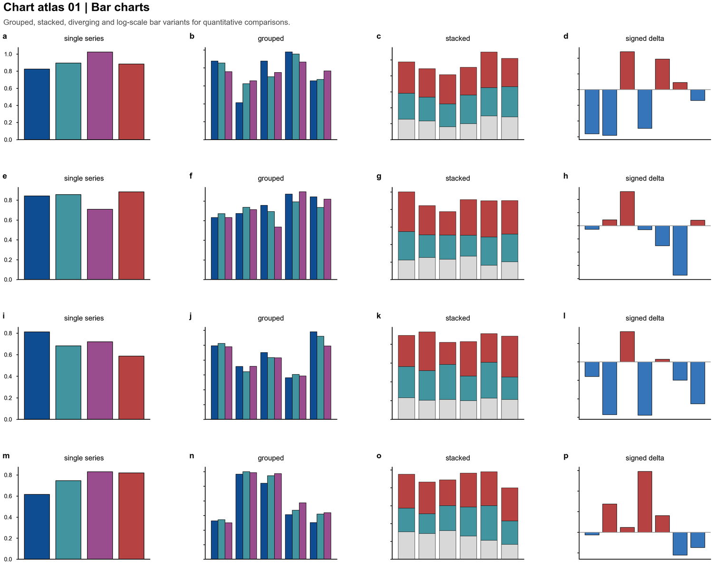
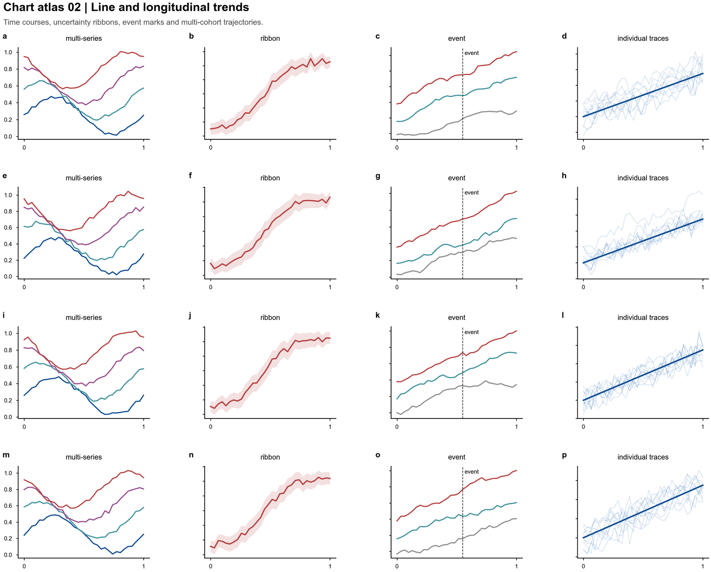
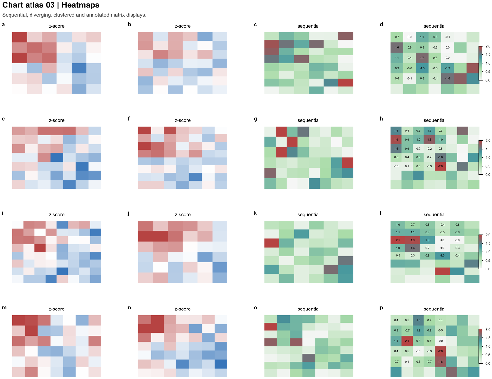
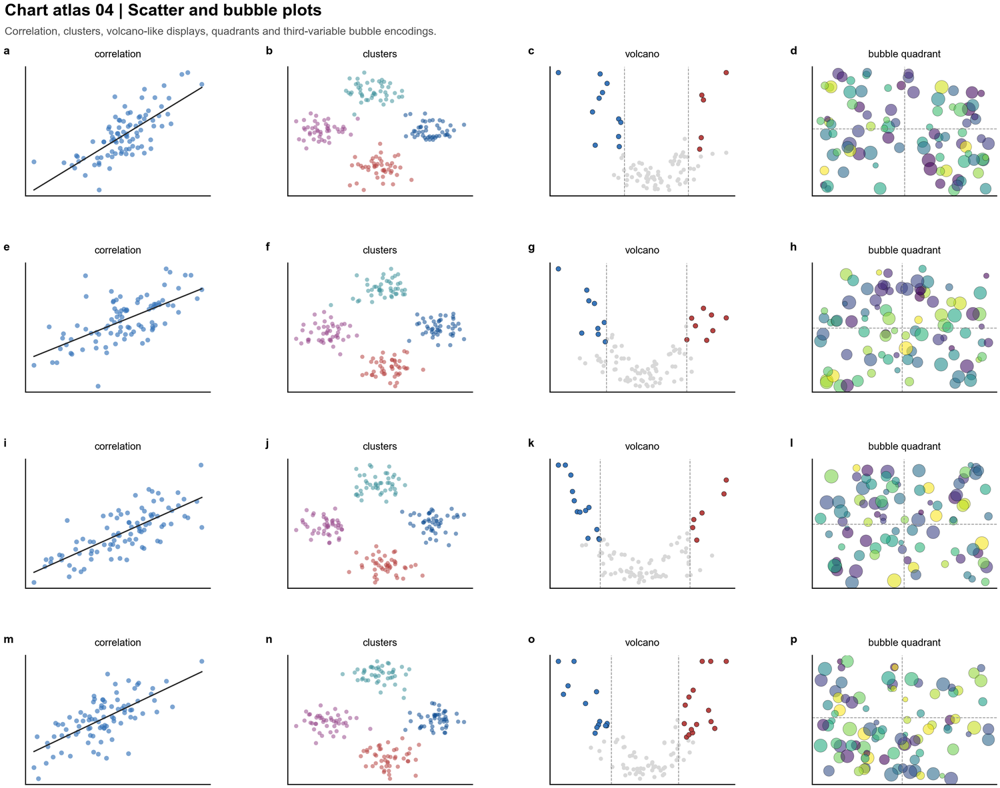
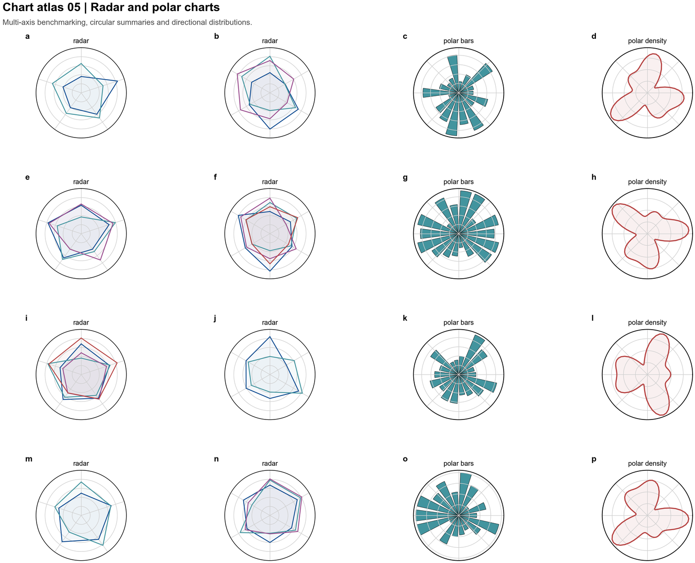
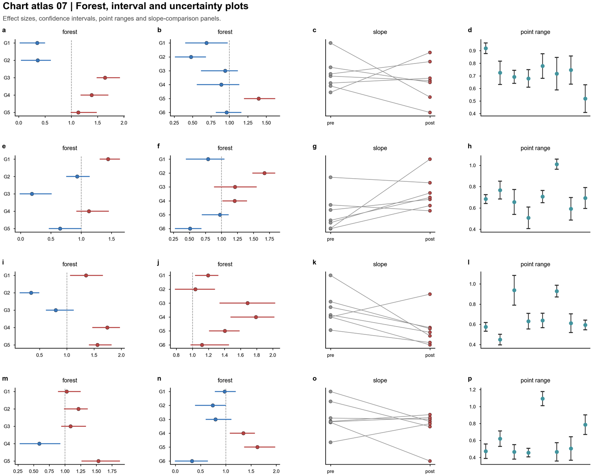
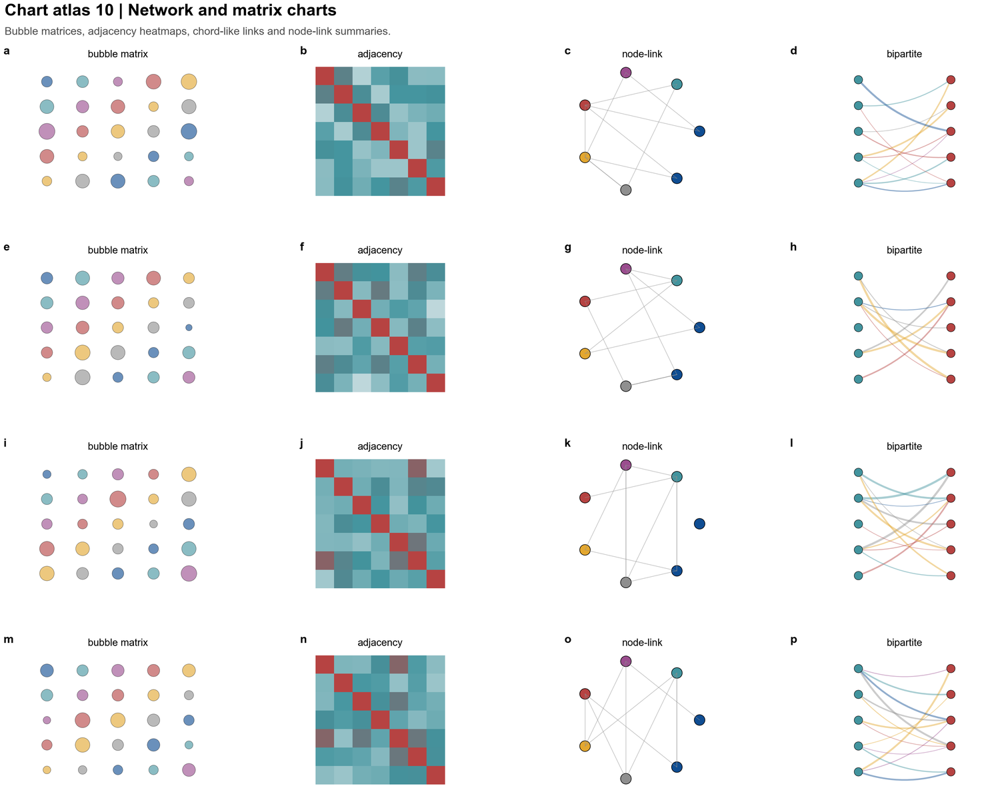

# data-chart-builder

Python matplotlib/seaborn charting skill for work data analysis.
9 chart families with ready-to-run recipes, built from [nature-figure](https://github.com/Yuan1z0825/nature-skills/tree/main/skills/nature-figure) v2.0.

## Chart Type Atlas

| # | Type | Preview | Common Use |
|---|------|---------|------------|
| 1 | Bar charts |  | Group comparison, signed differences, stacked composition |
| 2 | Line & trend |  | Time courses, uncertainty bands, intervention markers |
| 3 | Heatmaps |  | Z-score matrices, abundance, annotated tables |
| 4 | Scatter & bubble |  | Correlations, clusters, volcano-style, 3-variable encoding |
| 5 | Radar & polar |  | Multi-axis benchmarking, circular summaries |
| 6 | Distributions |  | Histograms, violin, box, ridgeline |
| 7 | Forest & interval |  | Effect sizes, confidence intervals, point ranges |
| 8 | Area & stacked |  | Filled trajectories, share stacks, cumulative curves |
| 9 | Network & matrix |  | Bubble matrices, adjacency, node-link, bipartite |

## Quick Start

```python
import matplotlib.pyplot as plt

plt.rcParams["font.family"] = "sans-serif"
plt.rcParams["font.sans-serif"] = ["Arial", "DejaVu Sans", "Liberation Sans"]
plt.rcParams["svg.fonttype"] = "none"

def save_chart(fig, filename, dpi=300):
    fig.savefig(f"{filename}.svg", bbox_inches="tight")
    fig.savefig(f"{filename}.png", dpi=dpi, bbox_inches="tight")
```

## File Structure

```
├── SKILL.md                     # Main router — chart type chooser + on-demand loading
└── references/
    ├── palette.md               # 6 palette families
    ├── api.md                   # 7 reusable helper functions
    ├── chart-patterns.md         # 14 layout patterns + 3 style techniques
    ├── chart-recipes.md          # 9 chart family recipes (copy-paste runnable)
    └── design-basics.md          # Color strategy, typography, panel hierarchy
```

## What This Is Not

- NOT for flowcharts, architecture diagrams, UML, or mind maps
- NOT for interactive/web charts (Plotly, Altair, Bokeh)
- NOT for dashboards or BI reports
- NOT for 3D rendering or GIS
- NOT for Illustrator/Figma-first layout
- NOT the original nature-figure — academic contracts, R backend, image plates, and 3D sphere are removed

## Credits

Adapted from [nature-figure](https://github.com/Yuan1z0825/nature-skills/tree/main/skills/nature-figure) v2.0.
Stripped of academic publication contracts, R backend, image plates, and journal-specific palettes.
Kept all chart helpers, layout patterns, and palette families with renamed generic identifiers.